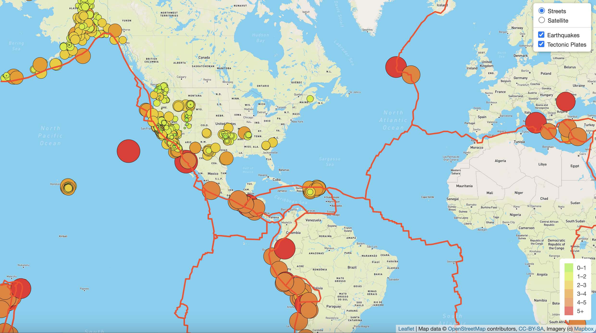
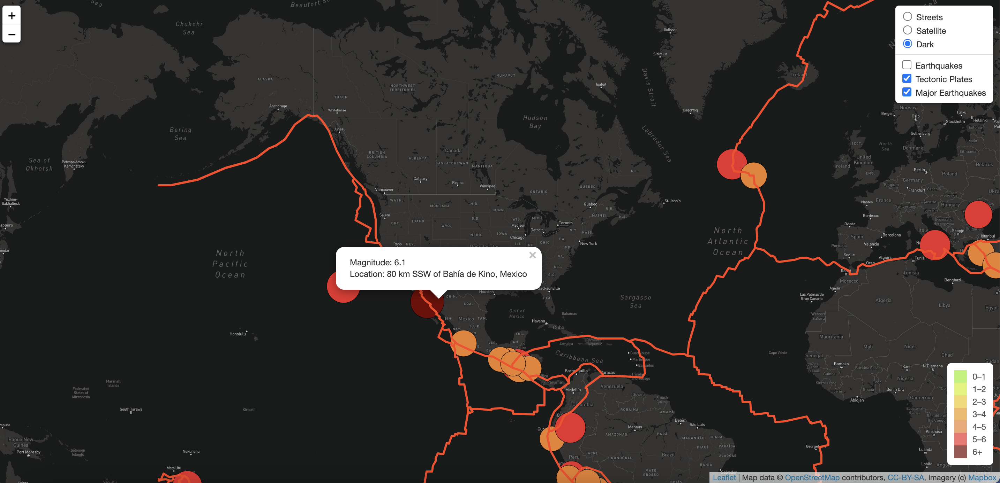

# Mapping_Earthquakes

## Overview

A data visualization specialist working for a disaster reporting network is tasked to tell data driven stories on the disasters around the world.
The main purpose of this project is to visually show the differences between the magnitudes of earthquakes all over the world for the last seven days. The following tasks are achieved in this process:
- Work with branches in GitHub. 
  - Create a branch from the main branch on GitHub.
  - Add, commit, and push data to a GitHub branch.
  - Merge a branch with the main branch on GitHub.
- Create the below geographical maps with GeoJSON earthquake data from a URL using the Leaflet.js API.
  - Map all recorded earthquakes in the past seven days.
  - Map the earthquake data in relation to the tectonic plates’ location on the earth.
  - Map all the earthquakes with a magnitude greater than 4.5.
- For each of the maps specified, 
  - Access GeoJSON data from a URL, parse the data and add it to a map.
  - Add markers, popups and multiple map layers using Leaflet control plugins.
  - Showcase the severity of earthquakes for viewers using HTML/CSS.
  - Add earthquake data as overlay and display a legend.
  - Render maps on a local server.

## Resources
- Leaflet 1.6
- GeoJSON
- JavaScript ES6
- HTML5
- CSS
- D3
- GeoJSON files from https://earthquake.usgs.gov
- Mapbox API

## Results

- To complete this project, GeoJSON earthquake data from the USGS website is used to retrieve geographical coordinates and the magnitudes of earthquakes for the last seven days. Leaflet library is used to plot the data on a Mapbox map through an API request. 
- The below map has Street and Satellite tile layers with Tectonic Plates (shown as red lines) and Earthquakes data (shown in circles) laid over these layers.

- Each earthquake is visually represented by a circle and color, where a higher magnitude has a larger diameter and is darker in color. A legend is added to facilitate reading in this regard.
- In addition, each earthquake has a popup marker that, when clicked, shows the magnitude and the location of the earthquake.
- The below image shows Major Earthquakes data added as an overlay on both the Street and Satellite tile layers.

- Besides the existing Street and Satellite views of the map, a Dark layer is added. The Earthquakes, Tectonic Plates and Major Earthquakes data can be toggled over a selected map layer as per user's choice. 

